# 🚀 Builde MLOPs for Prediction ML System
This project aims to build a full MLOps pipeline for a machine learning prediction system, focusing on diabetes prediction. It covers the steps from data processing, model training, evaluation, and deployment, to automating workflows with best practices. The goal is to demonstrate a robust, reproducible, and scalable approach to operationalizing ML models in production environments.

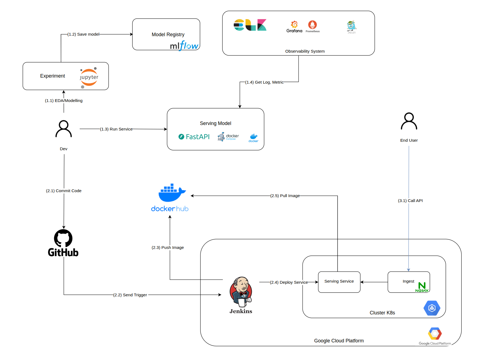

## 📑 Table of Contents
- [📊 Dataset](#-dataset)
- [🌐 Architecture Overview](#-architecture-overview)
  - [1. Develop Model](#1-develop-model)
  - [2. Web API](#2-web-api)
  - [3. Cloud & IAC](#3-cloud)
  - [4. CI/CD](#4-cicd)
  - [5. Observable](#5-observable-system)
  - [6. Datalake](#6-datalake)
<<<<<<< Updated upstream
  - [7. Batch Processing with Spark](#7.batch-processing)
  - [8. Streaming Processing](#8.streaming-processing)
=======
  - [7. Source System](#7-source-system)
  - [8. Pipeline Orchestration](#8-pipeline-orchestration)
>>>>>>> Stashed changes

## 🛠️ Prerequisite
To get started with this project, please ensure you have the following installed:
- Python 3.9 
- `anaconda 24.5.0`, `docker 27.5.1` installed

Install the required dependencies using the following command:
```bash
conda create -n dl python=3.9
conda activate dl
pip instgall -r requirements.txt
```

## 📊 Dataset
> Onset of Diabetes Prediction
Link: [data](https://machinelearningmastery.com/develop-first-xgboost-model-python-scikit-learn/)

This dataset is comprised of 8 input variables that describe medical details of patients and one output variable to indicate whether the patient will have an onset of diabetes within 5 years.
You can learn more about this dataset on the UCI Machine Learning Repository website.

## 1. Develop Model
Setting up MLflow Tracking Server with Docker
```bash
docker compose -f deployment/mlflow/docker-compose.yml up -d
```
- The tracking server will be available at: [http://localhost:5000](http://localhost:5000)
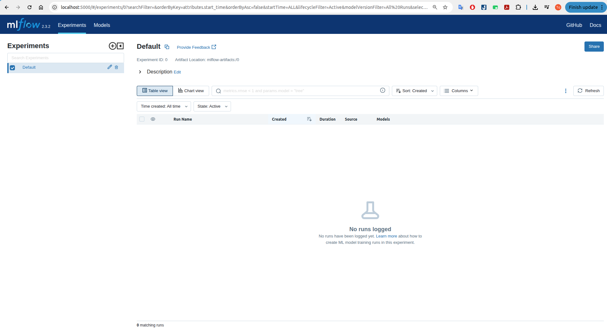

### Development model:
Run the following command to process your dataset:
```bash
python src/split_data.py
```
Training model and push model to model registry [http://localhost:5000](http://localhost:5000)

```bash
python src/train.py --model_name xgb # with xgb model
```
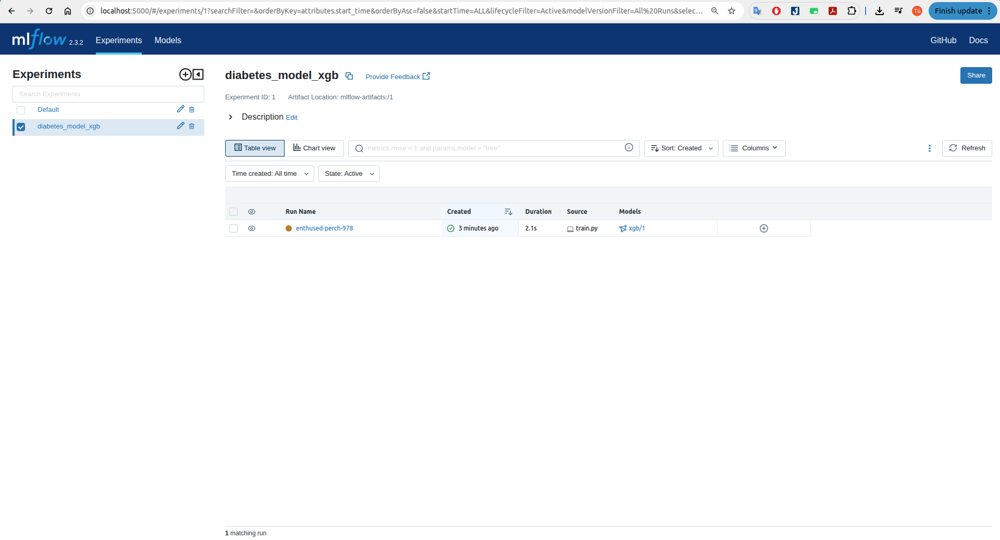

### Prediction Model
You can use the trained and registered model for prediction by loading it from the MLflow

Example usage:

```bash
python src/predict.py
```
This will:
- Load the saved model from the MLflow registry (using the default config or the one you provide in the script).
- Run predictions using the validation dataset (`data/val.csv`).
You can specify different model names or versions by editing the script or updating the CLI options inside `src/predict.py`:

## 2. Web API
To run the RESTful API service using FastAPI and Uvicorn in `src/main.py`, use the following command:
```bash
uvicorn src.main:app --host 0.0.0.0 --port 8080
```
The service will be available at [http://localhost:8080](http://localhost:8080).
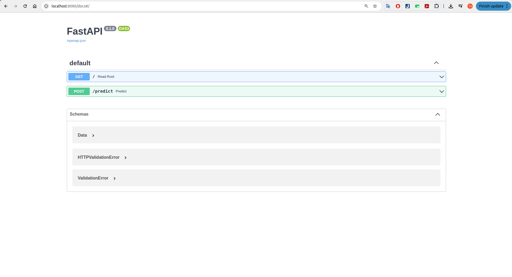
#### 📖 API Endpoints
- **POST /predict**  
  - Runs inference using the loaded model.
  - Expects a JSON payload containing:
    - `id`: (string or int) input id/reference
    - `data`: list of lists (rows of feature values)
    - `columns`: list of column names (feature names)

  - Example request:
    ```json
    {
      "id": "123",
      "data": [[6,148,72,35,0,33.6,0.627,50]],
      "columns": ["Pregnancies","Glucose","BloodPressure","SkinThickness","Insulin","BMI","DiabetesPedigreeFunction","Age"]
    }
    ```
  - Example using `curl`:
    ```bash
    curl -X POST "http://localhost:8080/predict" \
         -H "Content-Type: application/json" \
         -d '{
              "id": "123",
              "data": [[6,148,72,35,0,33.6,0.627,50]],
              "columns": ["Pregnancies","Glucose","BloodPressure","SkinThickness","Insulin","BMI","DiabetesPedigreeFunction","Age"]
            }'
    ```
  - Example response:
    ```json
    {
      "id": "123",
      "predictions": [1]
    }
    ```

> For more information, check the video guide at:
`video_records/service_docker.mkv`

## 3. Cloud
To deploy this solution on cloud infrastructure wit Google Cloud Platform, you can automate resource provisioning using [Terraform](https://www.terraform.io/). Below is a general guide for creating a compute VM and optionally a Kubernetes cluster.
### Prerequisites
1. **Google account & GCP project**
   - Make sure you have a [Google Cloud Platform (GCP) account](https://console.cloud.google.com/).
   - [Create a new GCP project](https://console.cloud.google.com/cloud-resource-manager) or select an existing one.
   - Note your **Project ID** (you'll need this for configuration).
2. **Set up billing and APIs**
   - Ensure billing is enabled for your project.
   - Enable the following APIs in the [APIs & Services dashboard](https://console.cloud.google.com/apis/library):
     - Compute Engine API
     - Kubernetes Engine API
     - Artifact Registry API (if you plan to store Docker images)
     - Service Account Credentials API
3. **Install & initialize Google Cloud CLI**

   - Install the [Google Cloud SDK](https://cloud.google.com/sdk/docs/install) if not already done.
   - Authenticate and set your project by running:
     ```bash
     gcloud auth login
     gcloud config set project <YOUR_PROJECT_ID>
     ```
### Install Terraform
- Follow the [Terraform installation guide](https://developer.hashicorp.com/terraform/downloads) for your platform.
- Common installation steps for Linux/macOS:
  ```bash
  # Download latest Terraform (update link as needed)
  wget https://releases.hashicorp.com/terraform/1.8.5/terraform_1.8.5_linux_amd64.zip
  unzip terraform_1.8.5_linux_amd64.zip
  sudo mv terraform /usr/local/bin/
  terraform -v
  ```
Once installed, you should be able to run:
```bash
terraform -version
```

### Create Cluster and VM Instance on GCP
Initialize and deploy with Terraform
From the `iac/terraform/` directory, run:
```bash
terraform init
terraform plan
terraform apply
```
Cluster on GCP:

VM on GCP
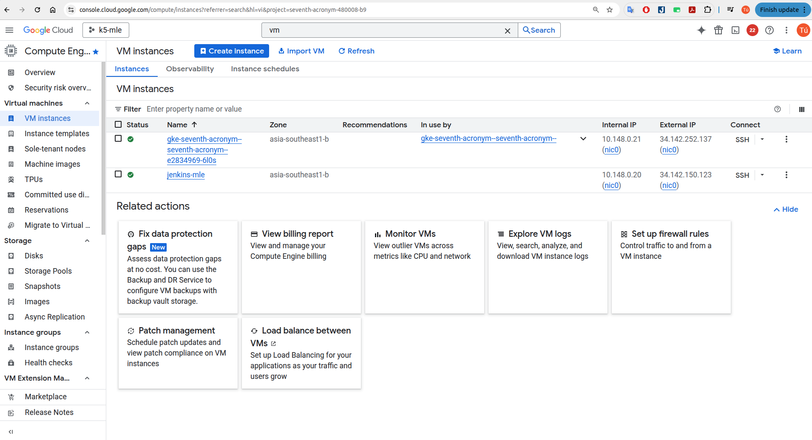

### Deploy service to cluster GCP
Config kubeconfig to connect to cluster: 
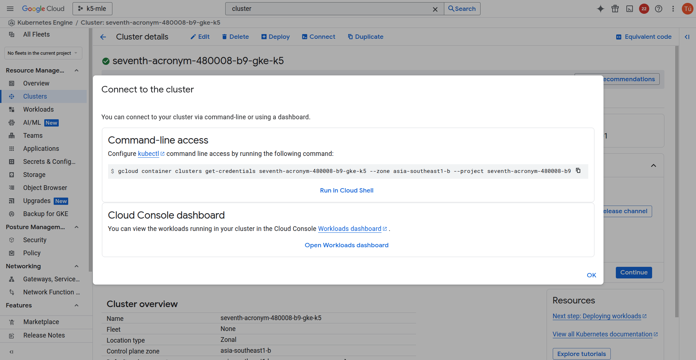
The following commands will deploy the NGINX ingress controller and the machine learning model service to your Kubernetes cluster on GCP:
```bash
# deploy nginx
kubectl create ns nginx-system
kubens nginx-system
cd k8s/helm/nginx-ingress
helm upgrade --install nginx-ingress .
# deploy model 
kubectl create ns model-serving
kubens model-serving
cd k8s/helm/diabetes
helm upgrade --install serving .
```
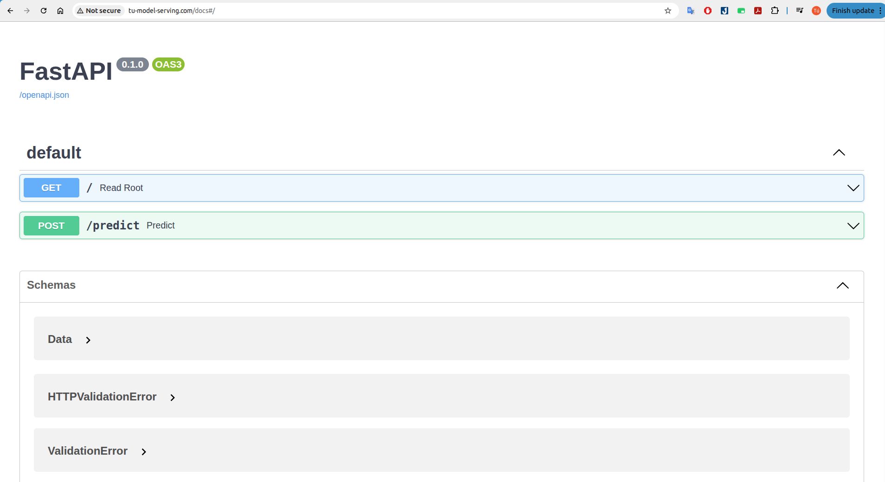
> For more information, check the video guide at:
`video_records/k8s_cloud.mkv`

### Deploy Jenkins to VM Instance on GCP 
Check the video guide at: `video_records/deploy_jenkins.mkv`    

## 4. CICD
### Jenkins Pipeline: Build, Push, and Deploy (GitLab → DockerHub → Kubernetes)

Below is a guideline to configure a Jenkins pipeline that will:
1. **Clone source code from GitLab**
2. **Build and push the Docker image to DockerHub**
3. **Deploy the application to your Kubernetes cluster**

#### 1. Prerequisites

- Jenkins server running, with Docker, kubectl, and Helm installed.
- Jenkins **GitLab** plugin installed.
- Jenkins credentials set up:
  - **GitLab**: Username/Password or Personal Access Token (as a secret)
  - **DockerHub**: Username/Password (as a DockerHub credential in Jenkins)
  - **Kubeconfig** for cluster deployment (as a secret file credential)
- Jenkins agent/runner has access to Docker daemon.
- Proper context/namespace access for kubectl/helm on the Jenkins host.

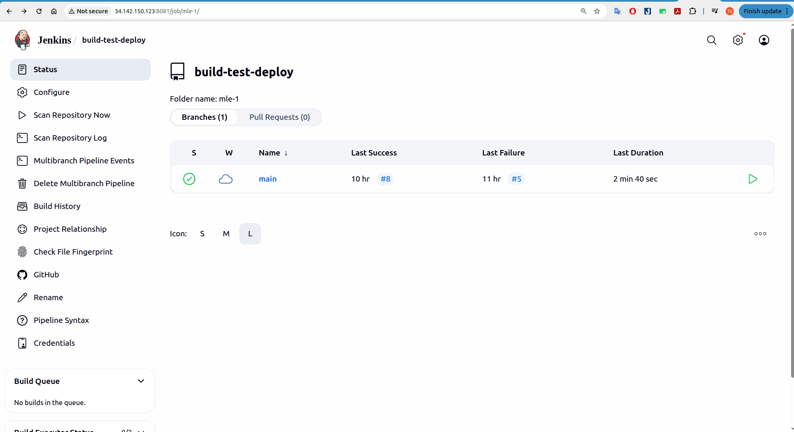

#### 2. Example Jenkins Pipeline (`Jenkinsfile`)

This file defines the automation stages for building, testing, packaging, and deploying the ML model service using Jenkins. The typical pipeline in this `Jenkinsfile` includes:
- **Test Stage:** Runs unit tests and validates dependencies by installing requirements and executing tests (usually using `pytest`).
- **Build Stage:** Builds a Docker image of the service and tags it with the Jenkins build number, preparing it for deployment.
- **Push Stage:** Authenticates with DockerHub (using stored Jenkins credentials) and pushes both the versioned and `latest` tags of the Docker image to the DockerHub registry.
- **Deploy Stage:** Uses Kubernetes and Helm inside a containerized environment to deploy or upgrade the service on a target Kubernetes cluster based on the latest image.

It also manages retention of build logs and incorporates timestamps for better build traceability. Credentials for DockerHub and any Kubernetes operations are managed securely via Jenkins credentials and secrets.  
To use the pipeline, create a `Jenkinsfile` in your project’s root directory and commit it to your repository.
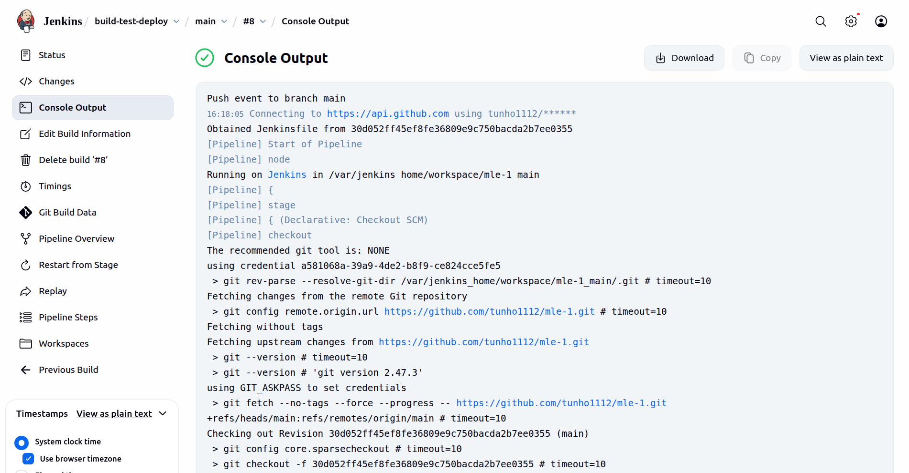

For video guidance, see: `video_records/jenkins_cicd.mkv`

## 5. Observable System
### Using ELK Stack for Observability
To monitor and observe logs from your ML serving system, you can deploy an ELK stack (Elasticsearch, Logstash, and Kibana).
The ELK stack helps aggregate logs, search through them efficiently, and visualize metrics in real time. Here’s how it fits into the MLOps pipeline:
- **Elasticsearch:** Stores and indexes logs from containers, Kubernetes pods, and other sources.
- **Logstash:** Collects, processes, and forwards logs from various sources into Elasticsearch.
- **Kibana:** Visualizes logs and metrics from Elasticsearch, providing dashboards for rapid troubleshooting and analytics.

### Deploy ELK
Run command: `docker compose -f deployment/elk/elk-docker-compose.yml -f deployment/elk/extensions/filebeat/filebeat-compose.yml up -d`

#### ELK Stack Setup Instructions
This project includes a pre-configured ELK stack for local observability and log analysis. You can deploy the ELK stack using the provided Docker Compose file.

**Steps to use ELK from `deployment/elk/elk-docker-compose.yml`:**

1. **Prerequisites**  
   Ensure Docker and Docker Compose are installed and running on your host machine.

2. **Start the ELK stack**  
   In the project root directory, run:
   ```bash
   docker compose -f deployment/elk/elk-docker-compose.yml up -d
   ```
   This will start the following services:
   - `elasticsearch` (data store & search engine)
   - `kibana` (dashboard UI)
   - `logstash` (log pipeline—optional configuration as needed)

3. **Access Kibana**  
   Once all containers are running, open your browser and navigate to:  
   [http://localhost:5601](http://localhost:5601)  
   Use Kibana to explore logs and set up dashboards.
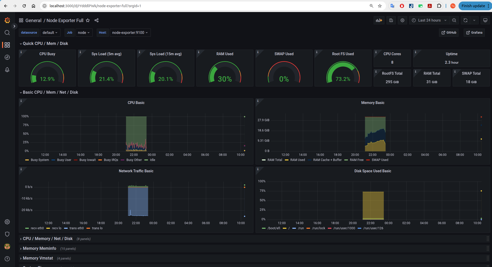

🔎 Real-time Log Streaming & Checking
To view logs in real time and monitor your services instantly, you can use built-in Docker log streaming or tools like Kibana's "Discover" tab. This setup lets you observe log output and troubleshoot your ML system as it runs.
    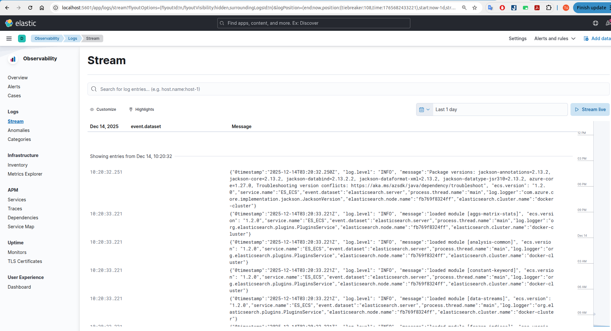

> For a video demo and walkthrough, see: `video_records/demo_elk.mkv`

#### Prometheus, Grafana & Jaeger Setup Instructions

This project includes a Docker Compose configuration for setting up observability and tracing using **Prometheus**, **Grafana**, and (optionally) **Jaeger**. This monitoring stack enables you to collect, monitor, and visualize performance metrics and traces from your ML service.

**Steps to use Prometheus & Grafana from `deployment/prom-graf-docker-compose.yaml`:**

1. **Prerequisites**  
   - Ensure Docker and Docker Compose are installed and available on your system.
   - The machine should have free ports: `9090` (Prometheus), `9100` (Node Exporter), `3000` (Grafana), `8090`, `8099`.

2. **Start the Monitoring Stack**  
   In your project root, run:
   ```bash
   docker compose -f deployment/prom-graf-docker-compose.yaml up -d
   ```
   This will spin up the following services:
   - `prometheus`: Metrics collection and alerting
   - `grafana`: Dashboard and visualization interface
   - `node-exporter`: Machine-level metrics
   - `cadvisor`: Container resource statistics
   - `alertmanager`: Alert management
   - `demo-metrics`: Example service being monitored

3. **Access Grafana and Prometheus Dashboards**
**Grafana:**  
Visit [http://localhost:3000](http://localhost:3000)  

**Prometheus:**  
Visit [http://localhost:9090](http://localhost:9090)
AI Predict exposes log counts request via a metrics endpoint (`/predict`), Prometheus can scrape and show these values.Use the search bar to query metrics such as: `ai_request_counter_total` 
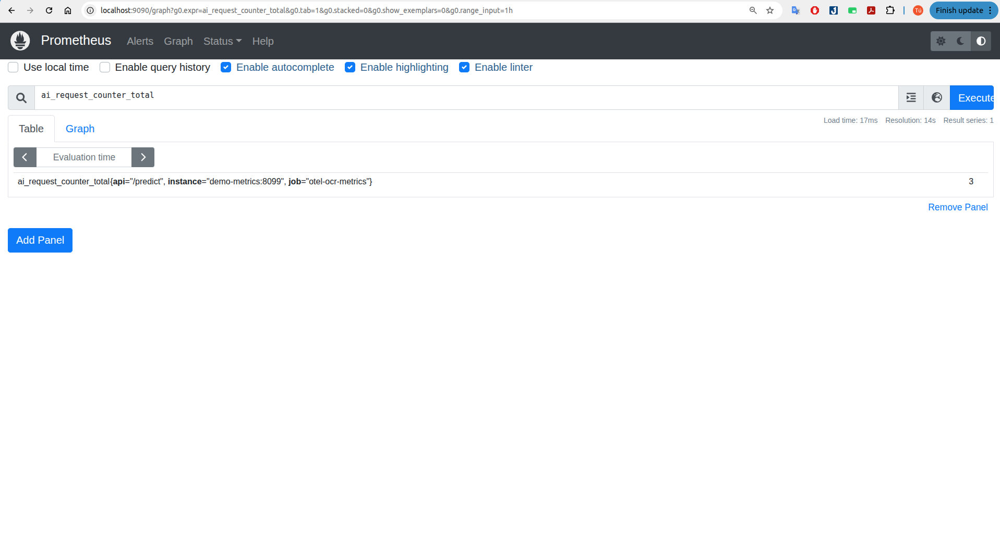

4. **Explore Node and Container Metrics**  
   - **Node Exporter** is available on [http://localhost:9100/metrics](http://localhost:9100/metrics)
   - **cAdvisor** UI is available at [http://localhost:8090](http://localhost:8090)
6. **Alerting**
   - Alertmanager and alert rules are configurable under `./prometheus/config/alert-rules.yml`.
7. **Tracing with Jaeger**
   - **Jaeger** is included in the stack for distributed tracing (see service `jaeger` in the compose file).
   - Jaeger collects and visualizes traces from your applications, helping you analyze request propagation and performance bottlenecks.
   - **Access the Jaeger UI** at: [http://localhost:16686](http://localhost:16686)
   - Explore traces, operations, and timing details for requests to the ML API, get service `ai-serving` 
   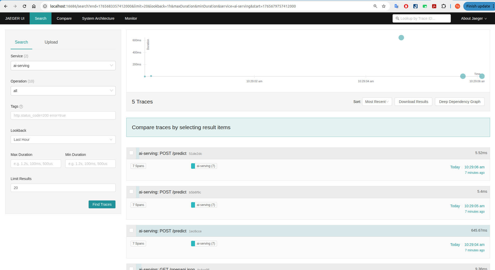

> For a demo video walkthrough, see: 
> - `video_records/logs-kibana-elasticsearch.mkv`
> - `video_records/jaeger_tracing.mov`

## 6. Datalake
### Start our data lake infrastructure
```shell
docker compose -f deployment/datalake/data-lake-with-mino.yaml up -d
```
### Generate data and push them to MinIO
```shell
conda create -n dl python=3.9
conda activate dl
pip install -r requirements.txt
```
Generate data and push to MinIO
```shell
# generata data
python deployment/datalake/utils/dump_data.py
# push data to minio 
python deployment/datalake/utils/export_data_to_datalake_minio.py
```
After pushing the data to MinIO, access `MinIO` at 
`http://localhost:9001/`, you should see your data already there.
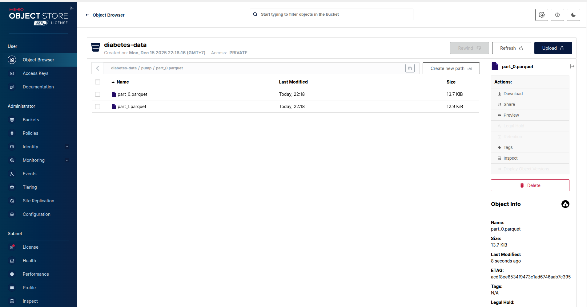
### Create data schema
After putting your files to `MinIO`, please execute `trino` container by the following command:
```shell
docker exec -ti datalake-trino bash
```
When you are already inside the `trino` container, typing `trino` to in an interactive mode
After that, run the following command to register a new schema for our data:
```sql
---Create a new schema to store tables
CREATE SCHEMA IF NOT EXISTS mle.diabetes_data
WITH (location = 's3://diabetes-data/');

---Create a new table in the newly created schema
CREATE TABLE IF NOT EXISTS mle.diabetes_data.pump (
    pregnancies INTEGER,
    glucose INTEGER,
    bloodpressure INTEGER,
    skinthickness INTEGER,
    insulin INTEGER,
    bmi DOUBLE,
    diabetespedigreefunction DOUBLE,
    age INTEGER,
    outcome INTEGER
) WITH (
  external_location = 's3://diabetes-data/pump',
  format = 'PARQUET'
);
```
### Query with DBeaver
1. Install `DBeaver` as in the following [guide](https://dbeaver.io/download/)
2. Connect to our database (type `trino`) using the following information (empty `password`):
  
3. Execute your queries on DBeaver
```sql
-- Create the pump tableSELECT * FROM mle.iot_time_series.pump 
SELECT * FROM mle.diabetes_data.pump;
```
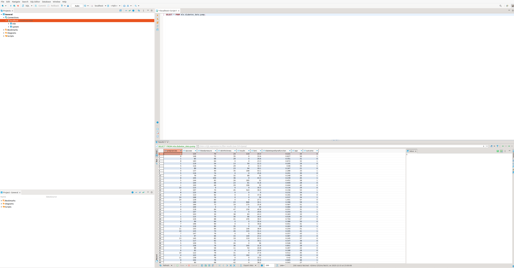
<<<<<<< Updated upstream
### Run continuous cdc postgresql kafka
```bash
cd diabetes-Prediction/deployment/cdc-postgresql-kafka
docker compose up -d
```
#### Register Connectior: 
Connect Debezium with PostgreSQL to receive any updates from the database
```bash
bash streaming/run.sh register_connector configs/postgresql-cdc.json
```
You can check connector on web ui debezium ui `localhost:8085`
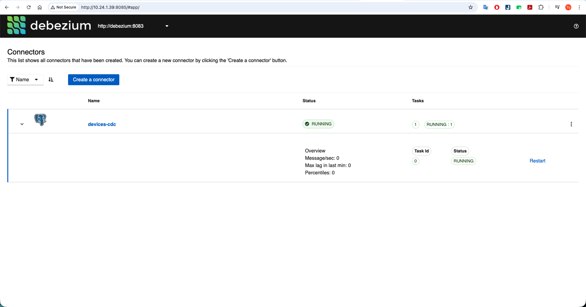
Run fake data: 
```bash
python streaming/utils/create_table.py
python streaming/utils/insert_table.py
```
You can check log kafka on control-centre `localhost:9021`.
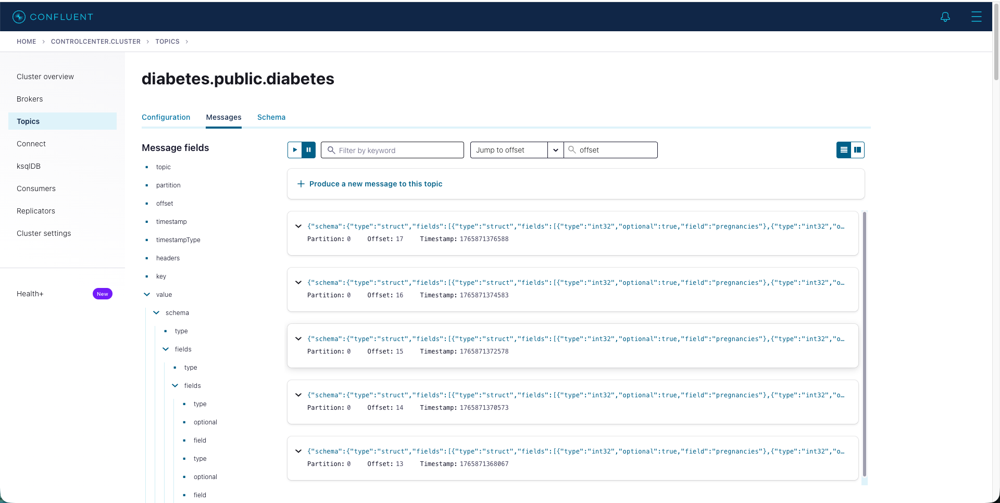


## 7. Batch Processing
Run batch processing with Spark and save data to datatwarehouse with format file .parquet.
```bash
python deployment/batch-processing-with-spark/scripts/batch_processing.py
```
You will show output: 
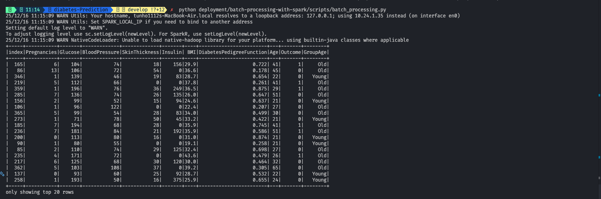
## 8. Streaming Processing
Deploy Streaming Processing with Kafka and Flink. 
Run commnand to start: `docker compose up -f diabetes-Prediction/deployment/streaming-processing/docker-compose.yaml -d`
You can check if Kafka producer is running normally by using
```shell
docker logs flink-kafka-producer
```
After that, get message from kafka and run flink for streaming processing, send output back to kafka with topic `sink_diabetes`. 
Run command: `python diabetes-Prediction/deployment/streaming-processing/scripts/table_api.py`
Check control-center in `localhost:9021` to view message
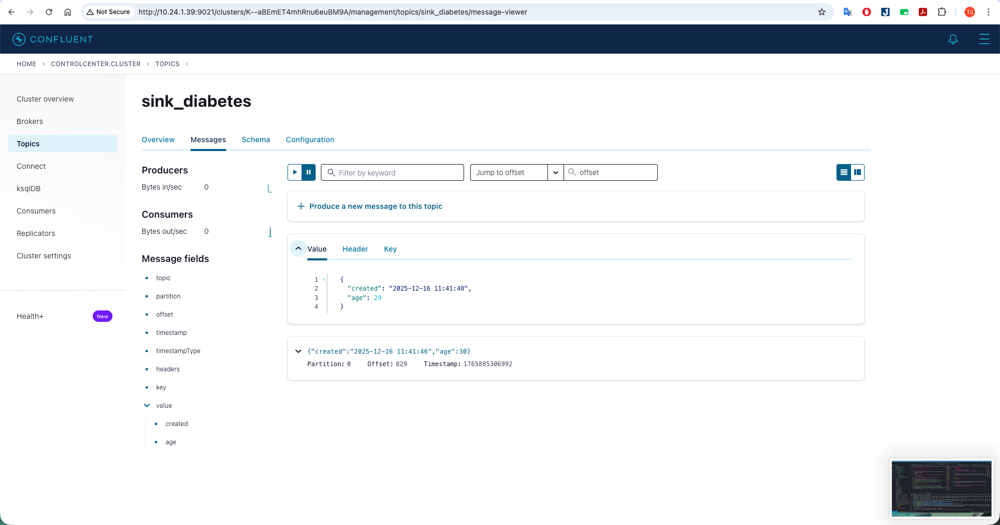
=======

## 7. Source System 
```shell
docker compose -f deployment/cdc-postgresql-kafka/docker-compose.yml up -d
```
### Register connectors
Connect Debezium with PostgreSQL to receive any updates from the database
```shell
cd deployment/cdc-postgresql-kafka
bash streaming/run.sh register_connector configs/postgresql-cdc.json
```
### Initialize the database
```shell
# Create an empty table in PostgreSQL
python streaming/utils/create_table.py
# Periodically insert a new record to the table
python streaming/utils/insert_table.py
```
## Observe new records on Kafka
Access the `control center` at the address `http://localhost:9021/` to see the new records
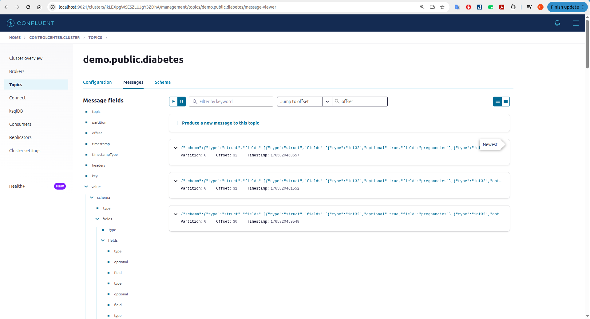

You can also verify whether your CDC connecter has been registered successfully in `control center`
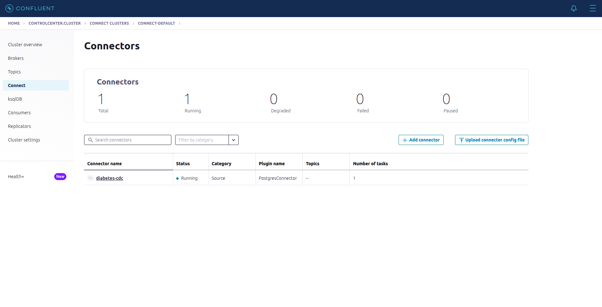

## 8. Pipeline Orchestration
Create pipeline orchstration with Airflow. Follow this step: 
```bash 
docker compose -f deployment/pipeline-orchestration up -d
```
Check all service are ready. Go to Airflow `localhost:8080`, Acc: `airflow/airflow`
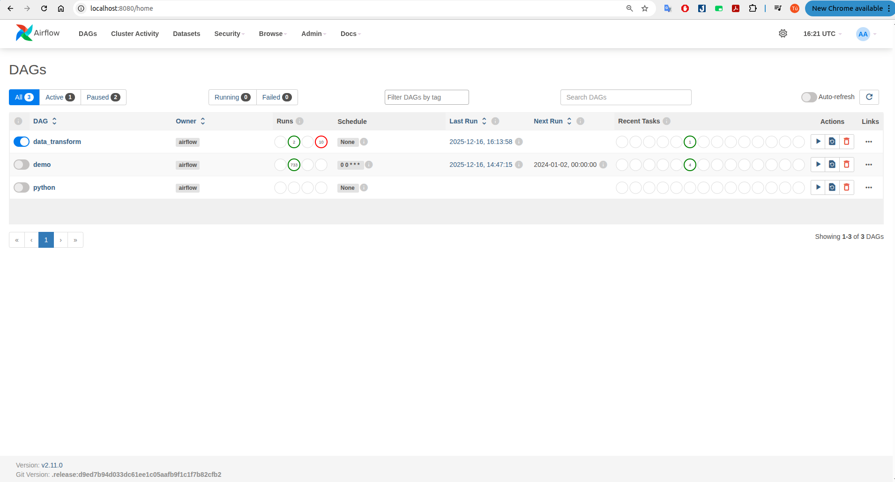
Create a job to ingest data from the data lake (MinIO), perform transformation and feature engineering, and load it into the data warehouse (PostgreSQL). Check file `deployment/pipeline-orchestration/run_env/dags/transform_data.py`. 
When job run successed, check output in database. 
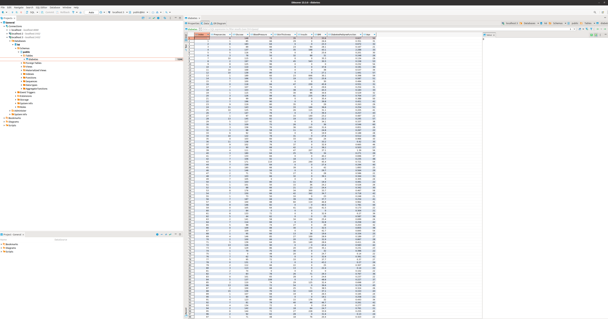
>>>>>>> Stashed changes
